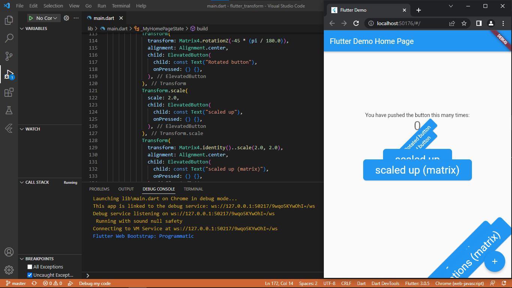
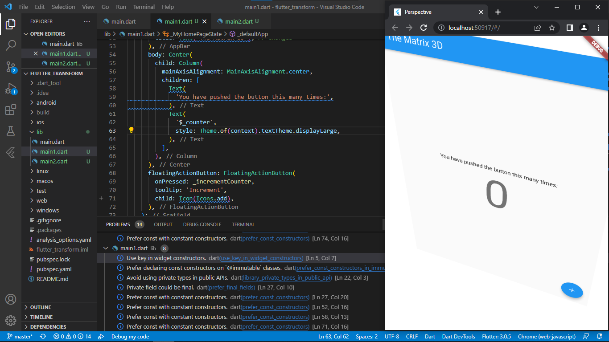
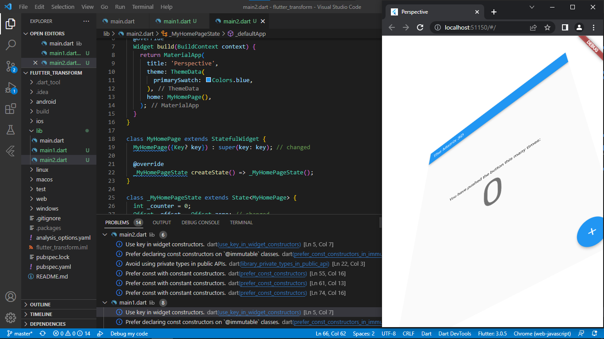

# flutter_transform
fungsi transform widget, Matrix4, dan jenis-jenis transformasi.

## Praktikum 1

pada praktikum pertama ini dilakukan percobaan transform button-button mulai dari rotate, scale dan translate

## Praktikum 2
pada praktikum ini dilakukan percobaan prespective. pada gambar dibawah ini memperlihatkan widget build yang telah di transform

pada gambar dibawah dilakukan penambahan GestureDetector yang berfungsi untuk mendeteksi gesture user untuk mengubah rotasi dari wiget

